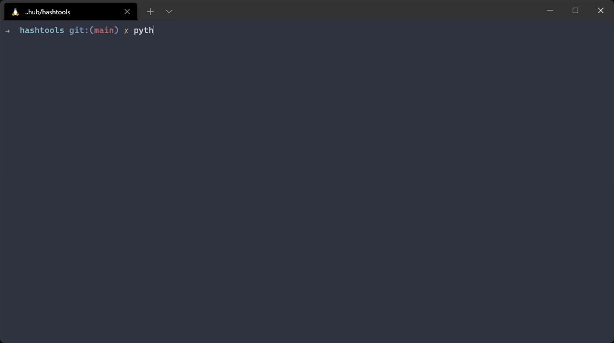

# HashTools
A python application that allows you to use hashes easily with hashlib.



Contents
========

 * [Requirements](#requirements)
 * [Installation](#installation)
 * [Features](#features)
 * [To-Do](#to-do)
 * [License](#license)

### Requirements
---
To use this program you will require [`python`](https://www.python.org/) 3.9 or higher

### Installation
---
Install with [`git`](https://git-scm.com/)
```
$ git clone https://github.com/tilas0/hashtools.git
$ cd hashtools
$ python3 main.py
```

### Features
---
- Supports multiple hashing methods (MD5, SHA256, SHA1)
- Cross-platform support
- Simple CLI
- Various different hash functions

### To-Do
---
- Command-line arguments
- Folder support

### License
---
Licensed under the [MIT License](LICENSE)